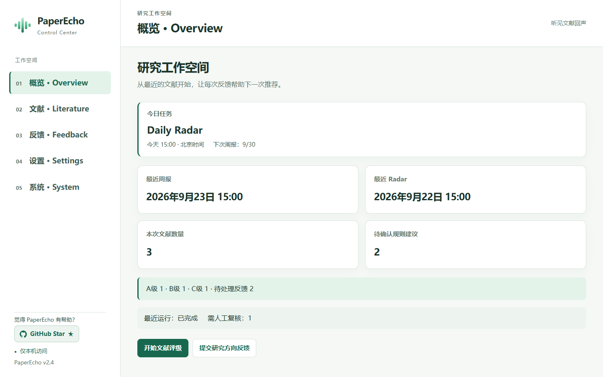

# PaperEcho

一个面向多学科研究的文献工作流：持续发现、筛选和整理新文献，并按需交付到 Zotero 或本地报告。

[快速开始](#快速开始) | [v2.4 更新](#更新内容) | [目录结构](#目录结构) | [English](#english-version)

## 这是什么

> **听见文献回声，找到值得追随的研究线索。**

新的文献不断出现，重要的不只是收集得更多，还要从持续更新的信息中，及时发现与自己研究相关的变化。

PaperEcho 是一套面向长期科研工作的文献追踪与整理工具。它持续获取新文献，完成去重、筛选、分级和整理，再将结果写入 Zotero 或生成本地报告，让值得关注的研究不被信息流淹没。

你可以选择 Zotero Desktop、Zotero Web API，或者完全脱离 Zotero 的 Standalone Local 路径；也可以根据研究方向组合 OpenAlex、Semantic Scholar、PubMed、Europe PMC、Crossref、RSS 或本地数据。

PaperEcho 不替代研究者作出判断。它负责整理不断传来的文献回声，把更多时间留给阅读、思考，以及下一步研究。

## 更新内容

**PaperEcho v2.4** 新增本地 Control Center，让文献发现、人工审阅和常用设置在同一个工作台衔接。Windows 双击 `PaperEcho.exe`，macOS 双击 `PaperEcho.app`；启动后会在默认浏览器打开当前工作区。源码使用仍需 Node.js 18+ 和项目依赖。



_工作台界面示意，图中状态为模拟数据；正式页面只读取当前工作区。_

- **从概览走向具体任务。** 概览显示今日任务、最近周报和待办；文献页只浏览实际运行结果中的 A/B/C 文献，反馈页集中处理常规评级、人工复核、研究方向反馈与规则建议。
- **反馈真正进入后续工作流。** 文献评级保存为正式反馈，供下次运行读取，但点击反馈不会立即修改 Zotero。规则建议只有在正式规则或检索配置安全写入并核验后才显示为已接受。
- **有分歧的评级先交给人。** 完整周报中规则与语义评级不一致、或缺少语义评级的候选先进入人工复核，不会未经确认就写回 Zotero。
- **常用设置更集中。** 工作台按组保存设置，提供 Desktop、Web、Local 互斥运行路径；凭据只显示配置状态，不回显原值。原有 XLSX、`screening_standards.docx` 和直接配置编辑仍可使用。
- **Radar 与周报按计划分工。** 外部调度器调用 Desktop 或 Web 路径的 `--scheduled-daily` 入口后，由 PaperEcho 根据计划时隙选择当日运行 Daily Radar 还是周报；本版本不自动注册系统定时任务，Local 路径不支持该入口。

详细使用与边界见 [Control Center 说明](docs/control-center.md)。PaperEcho 仍不提供 PDF 下载、全文阅读或内容总结。

## 核心特色

| 特色 | 说明 |
| --- | --- |
| Zotero Desktop | 继续使用本机 Zotero 文献库，通过 CLI 完成文献写入和整理。 |
| Zotero Web API | 连接 Zotero 云端文献库，无需保持桌面客户端运行。 |
| Standalone Local | 完全脱离 Zotero，通过本地文件完成文献处理和报告交付。 |
| 每日 Radar | 每天轻量发现新文献和重要研究线索；正式 Zotero 入库仍由周度流程统一完成。 |
| 多源文献发现 | 根据研究领域组合 OpenAlex、Semantic Scholar、PubMed、Europe PMC、Crossref、RSS 或本地数据，通过多源补充和统一去重降低单一来源漏召回的影响。 |
| 自动去重与分级 | 识别重复文献，完成 A/B/C/D 分级，把需要判断的内容留给研究者。 |
| Zotero 写回 | Desktop 和 Web 路径支持集合整理、批量写入和标题翻译回填。 |
| 本地独立交付 | Local 路径使用 JSON/JSONL 输入，在本地完成处理并生成报告。 |
| 反馈持续学习 | 将文章反馈和长期筛选标准用于后续筛选，减少重复调整。 |
| 文献状态监测 | 持续关注已入库文献的撤稿、勘误等公开状态变化，并以保守方式提醒和整理。 |
| 任务恢复 | 长流程中断或超时后保留已确认进度，恢复时核对实际状态，减少重复写入和误操作。 |
| 报告与邮件 | 生成周报和到期月报；既可发送完成通知，也可在 Stage1–4 失败时按配置告警。 |
| 自动维护 | 定期清理到期运行产物，同时保护长期配置、反馈和正式报告。 |

## Skills

| Skill | 作用 | 一句话说明 |
| --- | --- | --- |
| `paperecho-workflow` | 共享能力 | 为三条路径提供文献发现、筛选、报告、通知和定期维护。 |
| `paperecho-zotero-desktop` | Zotero Desktop | 适合继续使用本机 Zotero 文献库的用户，通过 CLI 执行读写。 |
| `paperecho-zotero-web` | Zotero Web API | 适合使用 Zotero 云端文献库、无需保持桌面客户端运行的用户。 |
| `paperecho-local` | Standalone Local | 适合不使用 Zotero、希望通过本地文件完成全部处理和交付的用户。 |
| `paperecho-update` | 安全更新 | 检查并部署官方最新 stable release，同时保护配置、状态和用户输出。 |

在 Codex 中选择与你的使用方式对应的 Skill，即可进入相应路径。

## 目录结构

```text
├── README.md
├── LICENSE
├── AGENTS.md
├── .env.example
├── package.json
├── package-lock.json
├── config/
│   ├── paperecho.config.example.json
│   ├── rss_sources.json
│   ├── pubmed_pmc_search.json
│   ├── source_selection.json
│   ├── review-workflow-rules.json
│   ├── title_translation.config.json
│   ├── preference_learning.config.json
│   └── README.md
├── docs/
│   ├── configuration.md
│   ├── paperecho-setup-template.md
│   ├── contract-workflow.md
│   ├── contract-writeback.md
│   ├── contract-export.md
│   └── ...
├── skills/
│   ├── paperecho-workflow/
│   ├── paperecho-zotero-desktop/
│   │   └── scripts/run.mjs
│   ├── paperecho-zotero-web/
│   │   └── scripts/run.mjs
│   ├── paperecho-local/
│   │   └── scripts/run.mjs
│   └── paperecho-update/
│       └── scripts/update.mjs
├── tests/
│   ├── full_workflow_benchmark/
│   └── helpers/
└── workflow/
    ├── tests/
    └── tools/
        ├── runner/
        │   ├── main.mjs
        │   ├── config_loader.mjs
        │   ├── preflight.mjs
        │   └── result_validation.mjs
        ├── stage0/main.mjs
        ├── local/main.mjs
        ├── stage1/
        ├── stage2/
        ├── stage3/
        ├── stage4/
        ├── stage5/
        ├── maintenance/
        └── lib/
```

## 快速开始

### 1. 准备环境

安装 Node.js >= 18、npm 和 PowerShell 7 (`pwsh`)。如果选择 Desktop 路径，还需要 Zotero Desktop；如果选择 Web 路径，需要 Zotero API key；Local 路径无需 Zotero。

### 2. 下载并安装依赖

```bash
git clone https://github.com/Chip-G0202/PaperEcho.git
cd PaperEcho
npm install
```

### 3. 创建本地配置

```powershell
Copy-Item config/paperecho.config.example.json config/paperecho.config.json
Copy-Item .env.example .env
```

在 `config/paperecho.config.json` 中选择 Desktop、Web 或 Local，并按研究领域选择合适的文献源或本地输入。API key、SMTP 密码等 secret 只写入本机 `.env`。完整字段见 [`docs/configuration.md`](docs/configuration.md)。

### 4. 检查并运行

在 Codex 中使用对应的路径 Skill：

```text
使用 $paperecho-zotero-desktop，读取 config/paperecho.config.json，先检查配置，再运行完整流程。
使用 $paperecho-zotero-web，读取 config/paperecho.config.json，先检查配置，再运行完整流程。
使用 $paperecho-local，读取 config/paperecho.config.json，先检查配置，再运行本地流程。
```

也可以直接检查选定路径：

```powershell
node skills/paperecho-zotero-desktop/scripts/run.mjs --check --config config/paperecho.config.json
node skills/paperecho-zotero-web/scripts/run.mjs --check --config config/paperecho.config.json
node skills/paperecho-local/scripts/run.mjs --check --config config/paperecho.config.json
```

检查通过后，将所选命令中的 `--check` 改为 `--run`。

检查官方 stable 更新可使用 `$paperecho-update`，或运行：

```powershell
node skills/paperecho-update/scripts/update.mjs --check --json
```

只有明确需要部署且检查结果为 `safeToApply=true` 时，才将 `--check` 改为 `--apply`。

## 支持项目

如果 PaperEcho 帮你减少了重复筛选、整理和汇报的时间，可以请我喝杯咖啡，或随手赞赏支持后续维护。


## 付费安装配置与研究方向配置包

PaperEcho 本身采用 MIT License，你可以自由下载、修改和自部署。付费服务面向希望节省配置时间、快速落地三路径工作流，或希望为特定研究方向准备筛选配置的用户。

联系信息：g2269204031@163.com

### 定制安装配置服务

适合希望尽快把流程跑起来，但不想自行处理运行环境和配置细节的用户。

- Node.js、PowerShell、Zotero 与路径依赖检查
- Desktop、Web 或 Local 路径选择与统一配置
- `.env`、标题翻译、偏好学习和 SMTP 配置
- Codex 定时任务、运行前检查与首次运行排查

### 研究方向配置包

适合已有明确研究方向，希望获得一套可维护、可审计配置模板的用户。

- OpenAlex、PubMed/PMC、RSS 与本地数据源策略
- A/B/C/D 分级规则与边界设计
- `screening_standards.md` 初始结构
- 标题翻译、偏好学习、周报/月报和自动化运行清单

## 免责声明

本项目用于文献检索、信息整理、研究筛选与学术写作辅助，不替代专业研究判断、同行评议或对原始文献的核查。

自动分级、翻译和 AI 生成内容仅供参考。涉及医学、法律、工程安全或其他高风险领域时，不应将 PaperEcho 的输出直接作为诊断、决策或操作依据。

## License

MIT License. See [LICENSE](LICENSE).

---

# English Version

# PaperEcho

A multidisciplinary literature workflow for continuously discovering, screening, and organizing research, with delivery to Zotero or local reports.

[Quick Start](#quick-start) | [Update](#update) | [Support](#support-the-project) | [License](#license-1)

## What is this?

> **Hear the echoes of research. Find the signals worth following.**

New papers arrive constantly. The challenge is not simply collecting more of them, but noticing which changes matter to your research.

PaperEcho is a literature tracking and organization tool for long-term research. It continuously collects new literature, removes duplicates, screens and grades results, then writes them to Zotero or produces local reports so relevant work is less likely to disappear into the stream.

Choose Zotero Desktop, Zotero Web API, or the fully independent Standalone Local path. Depending on your field, combine OpenAlex, Semantic Scholar, PubMed, Europe PMC, Crossref, RSS, or local data.

PaperEcho does not make research judgments for you. It handles the recurring organization work, leaving more time for reading, thinking, and deciding what to study next.

## Update

**PaperEcho v2.4** brings literature discovery, human review, and everyday settings together in a local Control Center. Open `PaperEcho.exe` on Windows or `PaperEcho.app` on macOS to launch the current workspace in your default browser. Source installations still require Node.js 18+ and project dependencies.

- **A focused workspace.** Overview shows today's task and recent results; Literature displays actual A/B/C papers; Feedback brings article ratings, manual review, research feedback, and rule suggestions together.
- **Feedback that carries forward.** Article ratings are saved for later workflow runs, not applied directly to Zotero on click. Rule suggestions show as accepted only after the formal rule or search configuration is safely written and verified.
- **Human review before writeback.** Candidates with conflicting rule and semantic grades, or a missing semantic grade, are held for review instead of being written to Zotero without confirmation.
- **Simpler settings.** Related options save as groups, Desktop/Web/Local runtime paths are mutually exclusive, and stored credentials are never displayed in raw form. Existing XLSX, `screening_standards.docx`, and direct configuration remain available.
- **One scheduled entry.** An external scheduler can call `--scheduled-daily` for Desktop or Web; PaperEcho selects Daily Radar or the weekly report according to the planned slot. This version does not register an OS scheduler, and Local does not support this entry.

See the [Control Center guide](docs/control-center.md). PaperEcho does not download PDFs, read full texts, or summarize their contents.

## Quick Start

1. Install Node.js 18+, npm, and PowerShell 7+. Desktop also requires Zotero Desktop; Web requires a Zotero API key; Local requires no Zotero installation.
2. Clone the repository and run `npm install`.
3. Copy `config/paperecho.config.example.json` to `config/paperecho.config.json` and `.env.example` to `.env`. Choose one path and select suitable literature sources or local input for your field.
4. Use `$paperecho-zotero-desktop`, `$paperecho-zotero-web`, or `$paperecho-local` in Codex. Run the selected launcher with `--check`, then change it to `--run` after the check passes.

To check for an official stable update, use `$paperecho-update` or run `node skills/paperecho-update/scripts/update.mjs --check --json`. Use `--apply` only after an explicit update request and a `safeToApply=true` result.

## Support the Project

If PaperEcho saves you time, you can buy me a coffee or send a small appreciation to support continued maintenance.


## Paid Setup & Research Direction Packs

PaperEcho is available under the MIT License. Paid support is intended for users who want faster setup or a maintainable direction-specific configuration pack.

Contact: g2269204031@163.com

### Custom installation & setup

Runtime checks, Desktop/Web/Local configuration, secret setup, scheduled Codex tasks, pre-run checks, and first-run troubleshooting.

### Research direction configuration pack

OpenAlex, PubMed/PMC, RSS, and local-source strategy design, A/B/C/D screening rules, screening standards, translation, feedback learning, and recurring report configuration.

## Disclaimer

PaperEcho supports literature discovery, information organization, research screening, and academic writing. It does not replace professional judgment, peer review, or verification against original sources. Its output must not be used directly for medical, legal, engineering-safety, or other high-risk decisions.

## License

MIT License. See [LICENSE](LICENSE).
